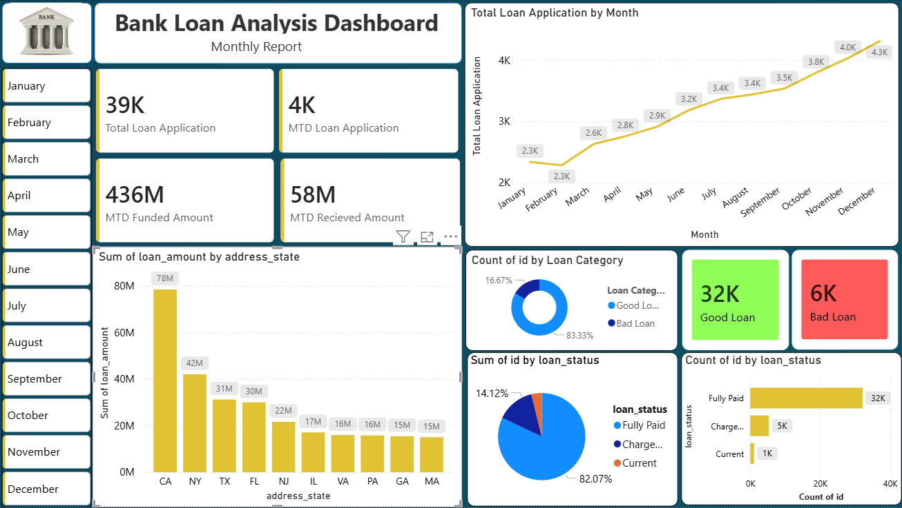

# Bank Loan Analysis Dashboard 

## 📌Project Overview
This project is a Power BI dashboard designed to analyze bank loan data, including total applications, funded amounts, received payments, and loan risk segmentation.

## 🎯Key Metrics
- Total Loan Application 

- MTD Loan Application 

- MTD Funded Amount 

- MTD Received Amount 

## 📈Features
- Monthly loan trend analysis

- Top 10 states by loan amount 

- Loan status distribution 

- Good vs Bad loan segmrntion

## 🛠️Tools
- Power BI 

- Dax 

-Data Cleaning

## 📷Dashboard

## 👩🏻‍💻Author
**Nency Purohit**
